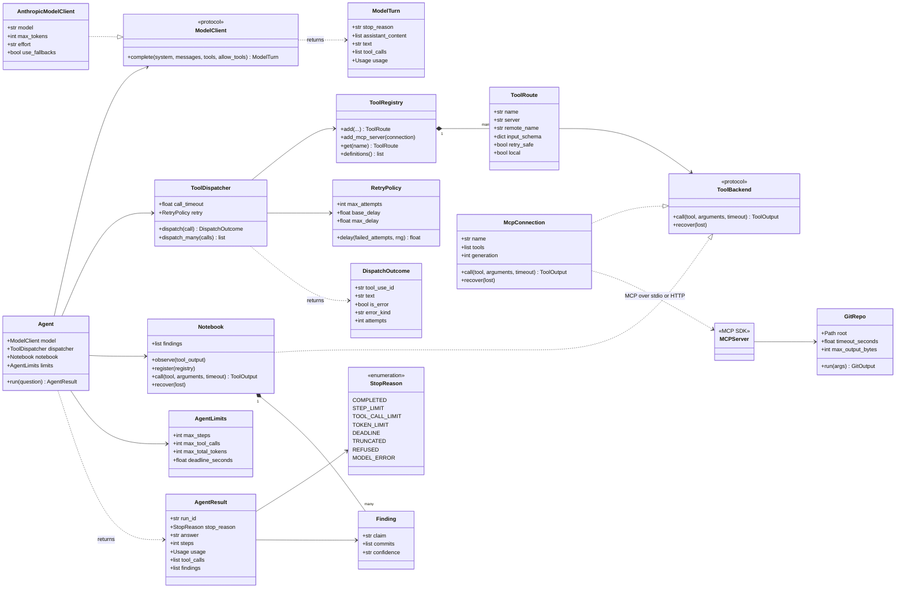

# Class diagram

Names match the code in `src/gitsleuth/`.

```mermaid
classDiagram
    direction LR

    class Agent {
        +ModelClient model
        +ToolDispatcher dispatcher
        +Notebook notebook
        +AgentLimits limits
        +run(question) AgentResult
    }
    class AgentLimits {
        +int max_steps
        +int max_tool_calls
        +int max_total_tokens
        +float deadline_seconds
    }
    class AgentResult {
        +str run_id
        +StopReason stop_reason
        +str answer
        +int steps
        +Usage usage
        +list tool_calls
        +list findings
    }
    class StopReason {
        <<enumeration>>
        COMPLETED
        STEP_LIMIT
        TOOL_CALL_LIMIT
        TOKEN_LIMIT
        DEADLINE
        TRUNCATED
        REFUSED
        MODEL_ERROR
    }
    class ModelClient {
        <<protocol>>
        +complete(system, messages, tools, allow_tools) ModelTurn
    }
    class AnthropicModelClient {
        +str model
        +int max_tokens
        +str effort
        +bool use_fallbacks
    }
    class ModelTurn {
        +str stop_reason
        +list assistant_content
        +str text
        +list tool_calls
        +Usage usage
    }
    class ToolDispatcher {
        +float call_timeout
        +RetryPolicy retry
        +dispatch(call) DispatchOutcome
        +dispatch_many(calls) list
    }
    class ToolRegistry {
        +add(...) ToolRoute
        +add_mcp_server(connection)
        +get(name) ToolRoute
        +definitions() list
    }
    class ToolRoute {
        +str name
        +str server
        +str remote_name
        +dict input_schema
        +bool retry_safe
        +bool local
    }
    class RetryPolicy {
        +int max_attempts
        +float base_delay
        +float max_delay
        +delay(failed_attempts, rng) float
    }
    class DispatchOutcome {
        +str tool_use_id
        +str text
        +bool is_error
        +str error_kind
        +int attempts
    }
    class ToolBackend {
        <<protocol>>
        +call(tool, arguments, timeout) ToolOutput
        +recover(lost)
    }
    class McpConnection {
        +str name
        +list tools
        +int generation
        +call(tool, arguments, timeout) ToolOutput
        +recover(lost)
    }
    class Notebook {
        +list findings
        +observe(tool_output)
        +register(registry)
        +call(tool, arguments, timeout) ToolOutput
        +recover(lost)
    }
    class Finding {
        +str claim
        +list commits
        +str confidence
    }
    class GitRepo {
        +Path root
        +float timeout_seconds
        +int max_output_bytes
        +run(args) GitOutput
    }
    class MCPServer {
        <<MCP SDK>>
    }

    Agent --> ModelClient
    Agent --> ToolDispatcher
    Agent --> Notebook
    Agent --> AgentLimits
    Agent ..> AgentResult : returns
    AgentResult --> StopReason
    AgentResult --> Finding
    AnthropicModelClient ..|> ModelClient
    ModelClient ..> ModelTurn : returns
    ToolDispatcher --> ToolRegistry
    ToolDispatcher --> RetryPolicy
    ToolDispatcher ..> DispatchOutcome : returns
    ToolRegistry "1" *-- "many" ToolRoute
    ToolRoute --> ToolBackend
    McpConnection ..|> ToolBackend
    Notebook ..|> ToolBackend
    Notebook "1" *-- "many" Finding
    McpConnection ..> MCPServer : MCP over stdio or HTTP
    MCPServer --> GitRepo
```
