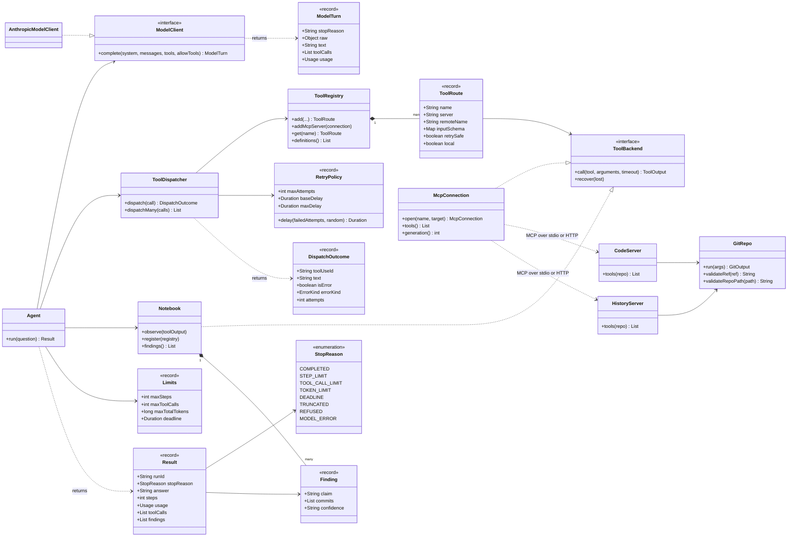

# Class diagram

Names match the code in `src/main/java/dev/gitsleuth/`. Nested types such as `Agent.Limits` are shown by their short names.

```mermaid
classDiagram
    direction LR

    class Agent {
        +run(question) Result
    }
    class Limits {
        <<record>>
        +int maxSteps
        +int maxToolCalls
        +long maxTotalTokens
        +Duration deadline
    }
    class Result {
        <<record>>
        +String runId
        +StopReason stopReason
        +String answer
        +int steps
        +Usage usage
        +List toolCalls
        +List findings
    }
    class StopReason {
        <<enumeration>>
        COMPLETED
        STEP_LIMIT
        TOOL_CALL_LIMIT
        TOKEN_LIMIT
        DEADLINE
        TRUNCATED
        REFUSED
        MODEL_ERROR
    }
    class ModelClient {
        <<interface>>
        +complete(system, messages, tools, allowTools) ModelTurn
    }
    class AnthropicModelClient
    class ModelTurn {
        <<record>>
        +String stopReason
        +Object raw
        +String text
        +List toolCalls
        +Usage usage
    }
    class ToolDispatcher {
        +dispatch(call) DispatchOutcome
        +dispatchMany(calls) List
    }
    class ToolRegistry {
        +add(...) ToolRoute
        +addMcpServer(connection)
        +get(name) ToolRoute
        +definitions() List
    }
    class ToolRoute {
        <<record>>
        +String name
        +String server
        +String remoteName
        +Map inputSchema
        +boolean retrySafe
        +boolean local
    }
    class RetryPolicy {
        <<record>>
        +int maxAttempts
        +Duration baseDelay
        +Duration maxDelay
        +delay(failedAttempts, random) Duration
    }
    class DispatchOutcome {
        <<record>>
        +String toolUseId
        +String text
        +boolean isError
        +ErrorKind errorKind
        +int attempts
    }
    class ToolBackend {
        <<interface>>
        +call(tool, arguments, timeout) ToolOutput
        +recover(lost)
    }
    class McpConnection {
        +open(name, target) McpConnection
        +tools() List
        +generation() int
    }
    class Notebook {
        +observe(toolOutput)
        +register(registry)
        +findings() List
    }
    class Finding {
        <<record>>
        +String claim
        +List commits
        +String confidence
    }
    class GitRepo {
        +run(args) GitOutput
        +validateRef(ref) String
        +validateRepoPath(path) String
    }
    class CodeServer {
        +tools(repo) List
    }
    class HistoryServer {
        +tools(repo) List
    }

    Agent --> ModelClient
    Agent --> ToolDispatcher
    Agent --> Notebook
    Agent --> Limits
    Agent ..> Result : returns
    Result --> StopReason
    Result --> Finding
    AnthropicModelClient ..|> ModelClient
    ModelClient ..> ModelTurn : returns
    ToolDispatcher --> ToolRegistry
    ToolDispatcher --> RetryPolicy
    ToolDispatcher ..> DispatchOutcome : returns
    ToolRegistry "1" *-- "many" ToolRoute
    ToolRoute --> ToolBackend
    McpConnection ..|> ToolBackend
    Notebook ..|> ToolBackend
    Notebook "1" *-- "many" Finding
    McpConnection ..> CodeServer : MCP over stdio or HTTP
    McpConnection ..> HistoryServer : MCP over stdio or HTTP
    CodeServer --> GitRepo
    HistoryServer --> GitRepo
```
