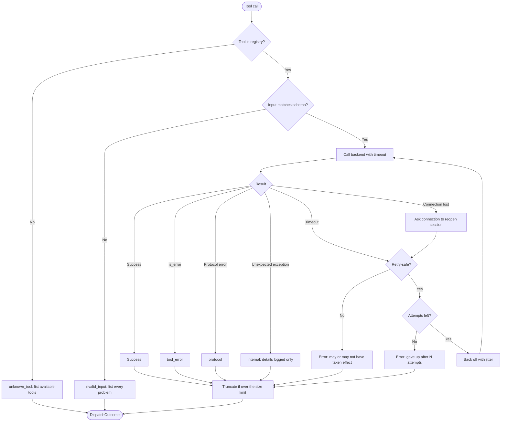

# Dispatcher decisions

How `ToolDispatcher.dispatch` handles one call. Every path ends in a `DispatchOutcome`, and the agent returns it to the model.

```mermaid
flowchart TD
    Start([Tool call]) --> Known{Tool in registry?}
    Known -->|No| Unknown[unknown_tool: list available tools]
    Known -->|Yes| Valid{Input matches schema?}
    Valid -->|No| Invalid[invalid_input: list every problem]
    Valid -->|Yes| Call[Call backend with timeout]
    Call --> Result{Result}
    Result -->|Success| Ok[Success]
    Result -->|is_error| ToolError[tool_error]
    Result -->|Protocol error| Protocol[protocol]
    Result -->|Unexpected exception| Internal[internal: details logged only]
    Result -->|Timeout| Safe{Retry-safe?}
    Result -->|Connection lost| Recover[Ask connection to reopen session] --> Safe
    Safe -->|No| NotRetried["Error: may or may not have taken effect"]
    Safe -->|Yes| Attempts{Attempts left?}
    Attempts -->|No| GaveUp["Error: gave up after N attempts"]
    Attempts -->|Yes| Backoff[Back off with jitter] --> Call
    Ok --> Truncate[Truncate if over the size limit]
    ToolError --> Truncate
    Protocol --> Truncate
    Internal --> Truncate
    NotRetried --> Truncate
    GaveUp --> Truncate
    Truncate --> Done([DispatchOutcome])
    Unknown --> Done
    Invalid --> Done
```
